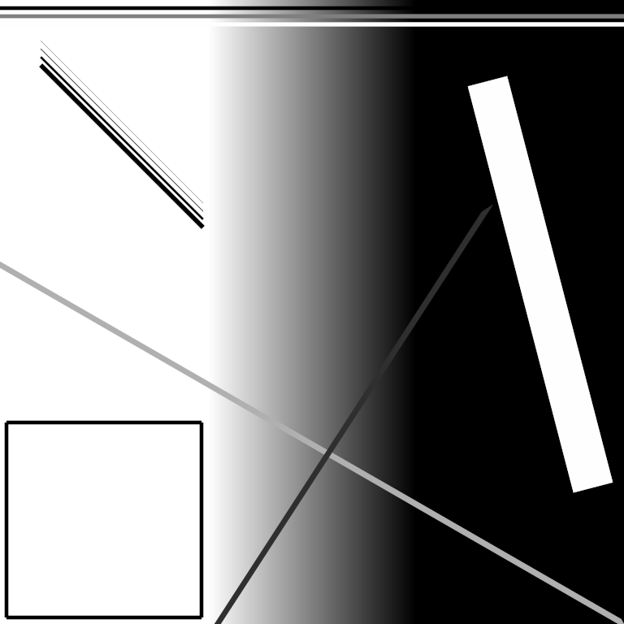

# Лабораторная работа 2

Программа отрисовывает прямую линию на сером изображении PNM P5 с применением сглаживания и гамма-коррекции. Пользователем задаётся расположение, толщина, яркость линии. Координаты можно задавать за пределами размеров изображения, в том числе отрицательные, в таком случае отрисована будет только видимая часть линии.

## Пример работы



PNM файл и скрипт для его создания есть в папке examples.

## Использование

```shell
./lab2.exe <входной_файл> <выходной_файл> <яркость> <толщина> <x0> <y0> <x1> <y1> <гамма>
```

Яркость - целое число от 0 до 255.
Толщина - положительное вещественное число.
x0, y0, x1, y1 - вещественные числа, координаты начала и конца линии.
Гамма - положительное вещественное число, по умолчанию 2.2.

## Сборка через Meson + Ninja

```shell
meson builddir
cd builddir
ninja
```
